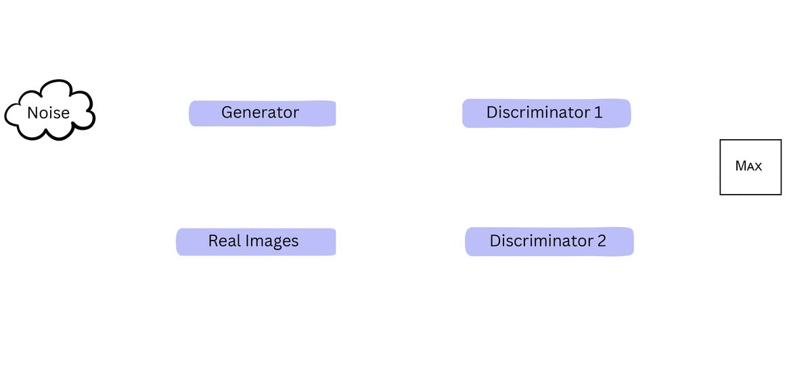
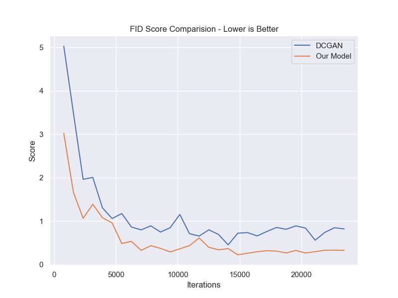
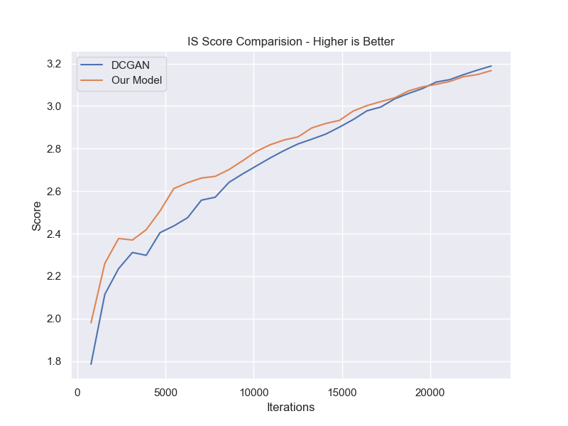
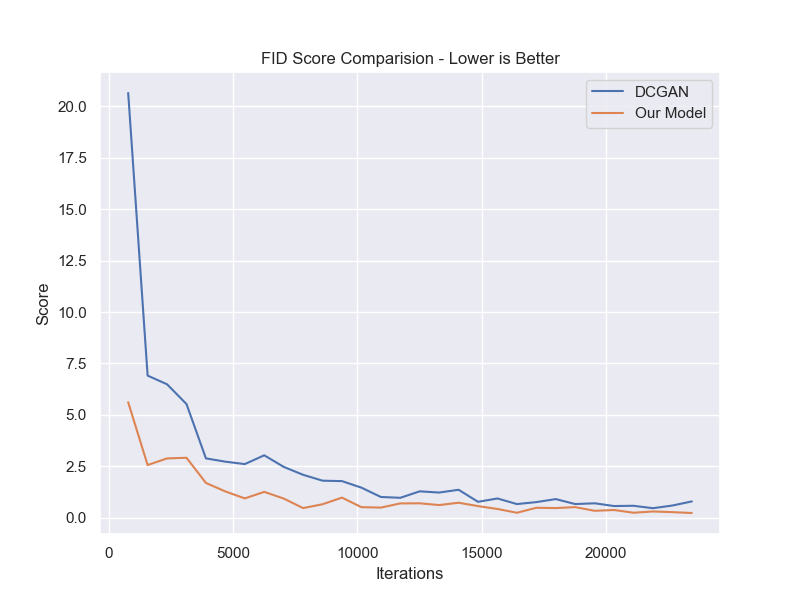
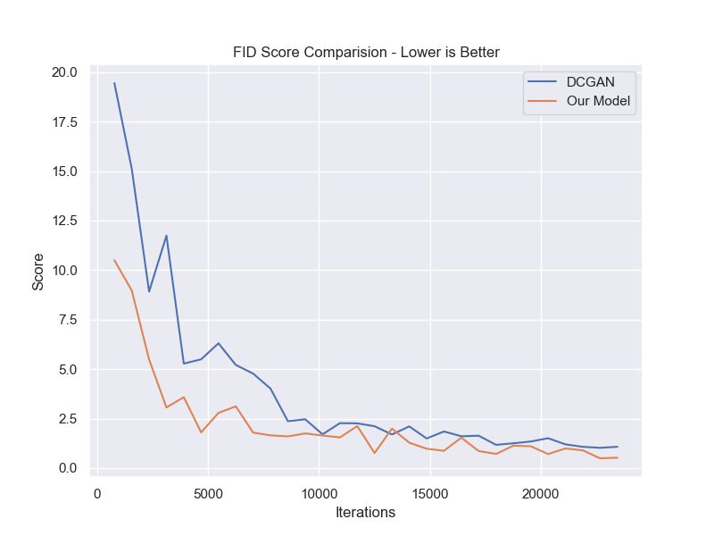
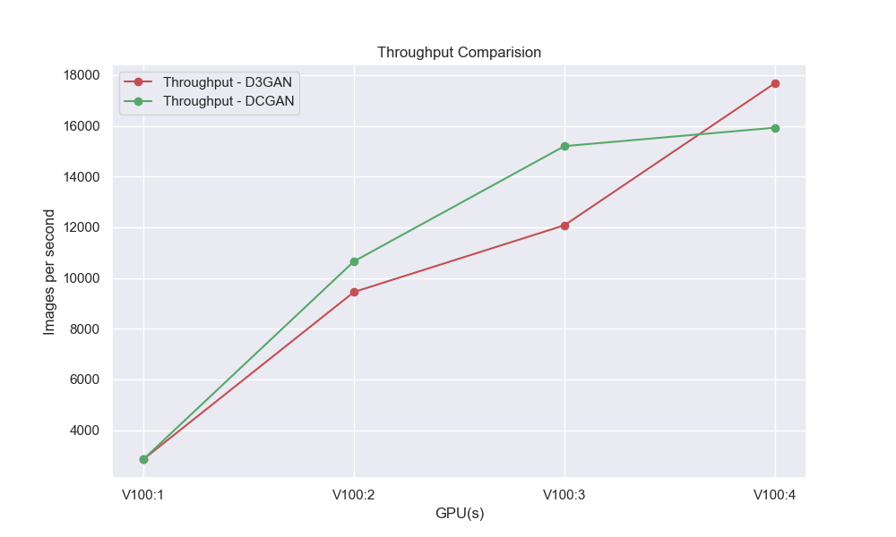
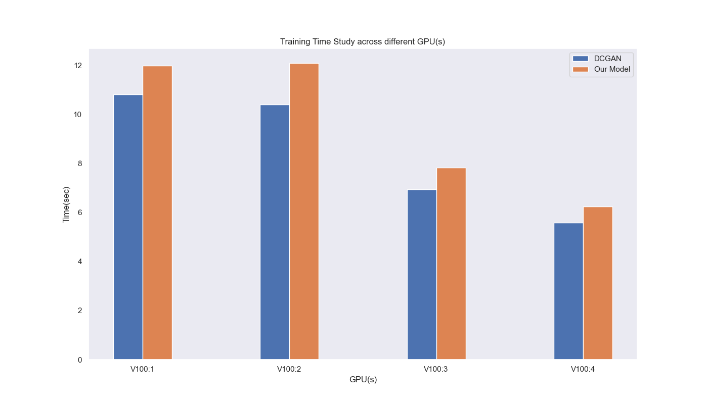
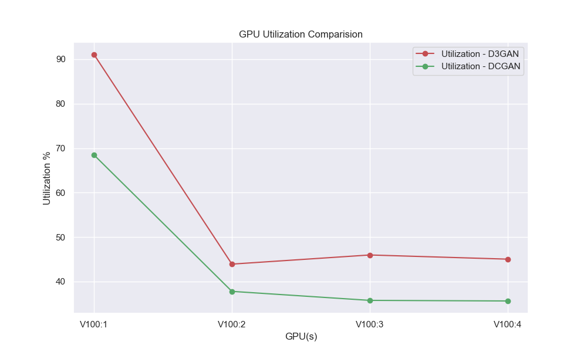

# Distributed Training of Dual Discriminator GANs.
### Authors : Savinay Shukla(ss16924), Ishaan Pitty (ip2244) 


<br>

In this project, we propose add another discriminator in a typical DCGAN training pipeline for the Generator to acheive better and faster convergence. Adding another discriminator will force the Generator to fool two discriminators at once, and disallow the dominance of Discriminator training. 

Our results are based on implementing our improvised training pipeline across various datasets which include **CIFAR-10, CIFAR-100, MNIST and SVHN**. We benchmarked our performance on various datasets to know possible limitations and improvements across a diverse set of images.

GPUs used for single-node and distributed-training : **NVIDIA RTX 3070, NVIDIA Tesla V100**.

**Copy of presentation**: https://tome.app/n-011/double-the-discrimination-clhmm4xfw1vyncd40wpg6enqe


Training Pipeline:




## Generation Demo

The demo on the **left is for DCGAN** image generation on the MNIST dataset, and **right one is our implementation**. As you can see, we generalize faster, and better.

<p align="center">


</p>


## How to run?

Our proposed implementation (both single node and distributed) are in the folder `D3GAN`. Run the following command for **single GPU** training: 

```
python3 train.py
```

and for **multi GPU** training:

```
python3 train_ddp.py
```

Configurations can be set in the `config.ini` file, for different hyper-parameters. We have selected some parameters for you, which according to us produces the most consistent comparision.

Same can be done for `DCGAN`.

**Please note**: DCGAN implementation is for benchmarking only.

# Results and Observations

We wish to focus on the evaluation metrics for generative models and how generator loss per iteration might lead to incorrect interpretations of image quality. For both **Inception Scores** and **Frechet Inception Distance**, we compared our implementation to the state-of-the-art DCGAN model. The charts below show how quickly our implementation converges for various batch sizes.

|  | 
|:--:| 
| FID Score: CIFAR-10 for Batch Size - 64 |

|  | 
|:--:| 
| IS Score: CIFAR-10 for Batch Size - 64 |

|  | 
|:--:| 
| FID Score: CIFAR-10 for Batch Size - 256 |

|  | 
|:--:| 
| FID Score: CIFAR-10 for Batch Size - 512 |

# Distributed Analysis

Below are some benchmarks on the scalibility of our implementation across multiple GPUs.

|  | 
|:--:| 
| Throughput Comparision |

|  | 
|:--:| 
| Training Time Comparision |

|  | 
|:--:| 
| GPU Utilization |


# Observations & Conclusions

Our experimental results show that the addition of another discriminator improves the quality of generated images **and its convergence is must faster**.

Our pipeline holds true across the majority of datasets that are widely used for generative modeling.

Even though training time increases because of an additional discriminator, the overall time to converge is much lesser than DCGAN.

We strongly believe that this pipeline could be generalized for multiple discriminators in the network. 

Stronger and faster convergence could be achieved with more sophisticated and deeper networks. 


