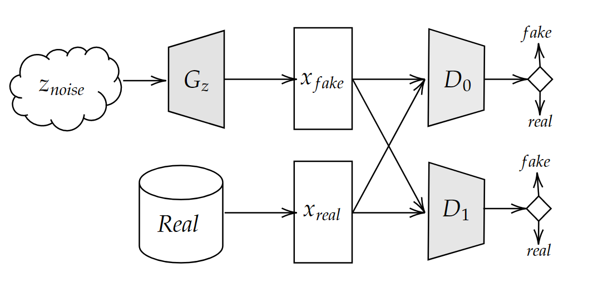
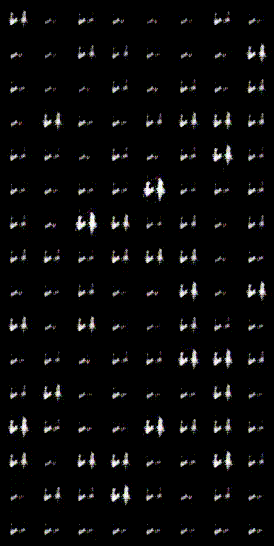
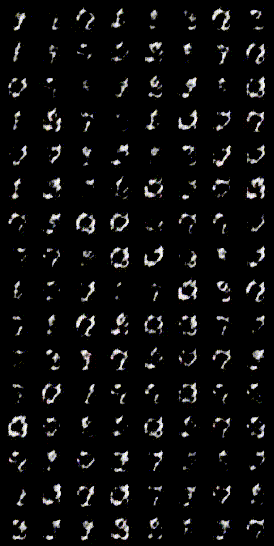
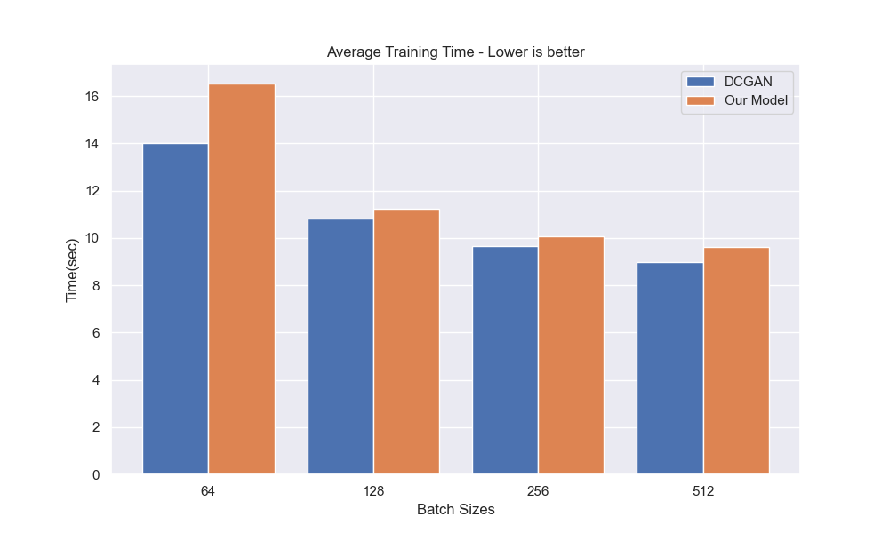

# Distributed Training of Dual Discriminator GANs.
### Authors : Savinay Shukla, Ishaan Pitty 


<br>

In this project, we propose add another discriminator in a typical DCGAN training pipeline for the Generator to acheive better and faster convergence. Adding another discriminator will force the Generator to fool two discriminators at once, and disallow any the dominance of Discriminator training.


<p align="center">


</p>

## How to run?

Our proposed implementation (both single node and distributed) are in the folder `D3GAN`. Run the following command for **single GPU** training: 

```
python3 train.py
```

and for **multi GPU** training:

```
python3 train_ddp.py
```

Configurations can be set in the `config.ini` file, for different hyper-parameters. We have selected some parameters for you, which according to us produces the most consistent comparision.

Same can be done for `DCGAN`.
Please note: DCGAN implementation is for benchmarking only.

# Results and Observations



